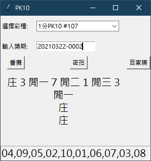

# py_tools

----
# 簡介
tkinter 介面驗獎工具
# 使用工具
+ tkinter
+ sqlite3
# 內容
1. 3 lotterys (list)
2. 1 input (issue)
3. 3 buttons (game types)
   + 番攤
   + 密拾
   + 百家樂
4. buttom info. (issue number)
# 工具畫面
1. 初始畫面

2. 番攤

3. 密拾

4. 百家樂

